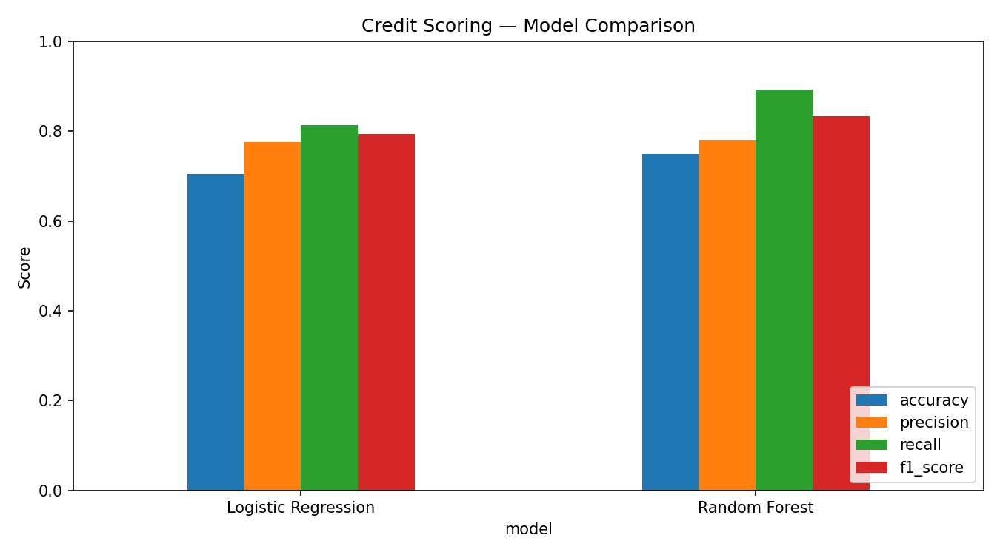
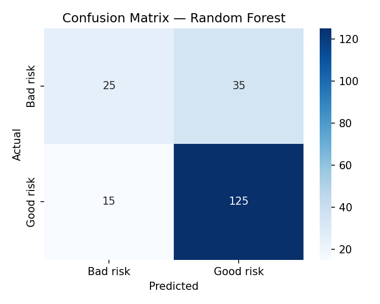

# Credit Scoring Model

**CodeAlpha Machine Learning Internship — Task Project**

## Problem
Banks and lenders need to decide whether a loan applicant is likely to repay.
This project builds a classification model that predicts an applicant's
**creditworthiness** — *good credit risk* vs *bad credit risk* — from their
financial and personal profile, so lending decisions can be faster and more
consistent.

## Dataset
**German Credit Dataset** — UCI Machine Learning Repository (Statlog version)

- 1,000 applicants, 20 features (7 numeric, 13 categorical) + target
- Target: `1 = good credit (700 applicants)`, `0 = bad credit (300 applicants)`
- Source: https://archive.ics.uci.edu/ml/machine-learning-databases/statlog/german/german.data
- The script downloads the data on first run and caches a parsed copy at
  `data/german_credit.csv`, so later runs work offline.

## Approach
- Categorical features: most-frequent imputation + one-hot encoding
- Numeric features: median imputation + standard scaling
- Train / test split: 80 / 20, stratified, `random_state=42`

## Models Used
1. **Logistic Regression** (`max_iter=1000`)
2. **Random Forest Classifier** (300 trees)

## Results (actual test-set results from running `credit_scoring.py`)
*Precision / recall / F1 below are for the positive class = "good risk".*

| Model | Accuracy | Precision | Recall | F1-Score |
|---|---|---|---|---|
| Logistic Regression | 0.7050 | 0.7755 | 0.8143 | 0.7944 |
| **Random Forest** | **0.7500** | **0.7812** | **0.8929** | **0.8333** |

**Conclusion:** Random Forest performed best on every metric, reaching
**75.0% accuracy** and an F1-score of **0.8333**. Both models are much better
at spotting good applicants than bad ones — expected, since bad-risk cases are
the minority class (30%) and are harder to separate.

Full metrics: [`outputs/metrics.json`](outputs/metrics.json)

## Output Plots
- Model comparison: `outputs/model_comparison.png`
- Confusion matrix (Logistic Regression): `outputs/confusion_matrix_logistic_regression.png`
- Confusion matrix (Random Forest): `outputs/confusion_matrix_random_forest.png`




## How to Run
```bash
pip install -r requirements.txt
python credit_scoring.py
```
Results are printed in the terminal and saved to `outputs/` (plots + `metrics.json`).

## Project Structure
```
CodeAlpha_CreditScoringModel/
├── credit_scoring.py
├── requirements.txt
├── README.md
├── data/
│   └── german_credit.csv        (cached after first run)
└── outputs/
    ├── metrics.json
    ├── model_comparison.png
    ├── confusion_matrix_logistic_regression.png
    └── confusion_matrix_random_forest.png
```

---
**Author: Muhammad Abdul Rafay — CodeAlpha ML Intern**
